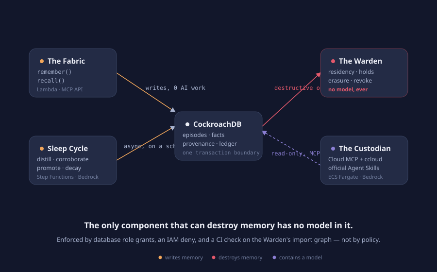

<p align="center">
  
</p>

<h1 align="center">Mnemos — Accountable Memory for Agents</h1>

<p align="center">
  <em>Agents don't fail when they're wrong. They fail when they forget —<br/>
  or when they remember what they never should have.</em><br/>
  Governed, jurisdictional, provenance-complete, poison-resistant memory.<br/>
  Built on <a href="https://www.cockroachlabs.com/">CockroachDB</a> + AWS for the
  <a href="https://cockroachdb-aws.devpost.com/">CockroachDB × AWS "Build with Agentic Memory" hackathon</a>.
</p>

<p align="center">
  <a href="#quickstart">Quickstart</a> ·
  <a href="#architecture">Architecture</a> ·
  <a href="#the-four-demo-moments">Demos</a> ·
  <a href="#what-we-do-not-claim">Limits</a> ·
  <a href="#hackathon-rubric-mapping">Rubric mapping</a> ·
  <a href="docs/">Docs</a>
</p>

---

## Three questions nobody can answer today

Every agent framework will offer you somewhere to put memory. Recall quality
is crowded and roughly solved. These three are not:

1. **Where does this memory legally live?** An agent in Frankfurt recalls a
   patient record. Did that row cross a border? Memory layers treat storage as
   one undifferentiated blob, so nobody knows.
2. **What did the agent believe at 14:32, and why did it act?** After an agent
   causes harm you need a deposition, not a log file. Today you get neither.
3. **One poisoned fact entered memory six weeks ago — what did it touch?**
   Prompt injection that *persists* is agentic memory's defining security
   hole. One malicious fact silently contaminates every future recall, and no
   system can enumerate the damage, let alone undo it.

Mnemos answers all three — and it can only answer them because the vectors,
the provenance graph, and the audit ledger are **one transactionally
consistent distributed database**, not three services with a gap between them.
That is the argument for CockroachDB, made falsifiable.

## The four planes

| Plane | Role | Contains an LLM? |
|---|---|---|
| **The Fabric** | Memory: episodic (Row-Level TTL) → semantic (C-SPANN vectors + full-text) → procedural | no |
| **The Ledger** | Accountability: sharded hash chains, Merkle checkpoints anchored to S3 Object Lock, depositions | no |
| **The Warden** | Governance: residency, legal hold, four erasure modes, blast-radius revocation, crypto-shred | **no — enforced by IAM, CI, and a runtime self-check** |
| **The Custodian** | Self-maintenance: runs official CockroachDB Agent Skills over the Cloud MCP Server + `ccloud`, files findings back into memory | yes (Bedrock) |

**The only component that can destroy memory has no model in it.**

## The three pillars

**I. Residency** — `REGIONAL BY ROW` homes every episode to a jurisdiction. An
agent elsewhere gets policy-approved *derived* answers; raw content never
crosses a border, and every crossing is logged with the policy that allowed
it. No vector database can do this.

**II. Accountability** — `AS OF SYSTEM TIME` gives temporal recall: reconstruct
exactly what the agent believed at any past instant. `explain(action_id)`
emits a deposition — action ← recalls ← facts as they were ← provenance ←
raw sources — hash-verified end to end and anchored outside the database.
Export it as HTML that verifies itself offline.

**III. Integrity** — everything an LLM writes enters memory as `unverified` and
must be independently corroborated to become recallable. When a source turns
out to be malicious, `revoke_source()` computes the transitive blast radius
across facts, corroborations, skills, past recalls, and declared actions —
then revokes all of it in **one serializable transaction** and broadcasts the
revocation over a changefeed. Affected depositions then read: *this decision
was influenced by subsequently-revoked memory.*

## The five invariants

Each has a named test in `tests/invariants/`. Run `make invariants`.

1. **No LLM-driven process holds DELETE or governance privileges.** Enforced by
   database role grants, an IAM deny on `bedrock:InvokeModel` for the Warden,
   and a CI dependency check on the Warden's transitive import graph.
2. **Every state-changing memory op appends a hash-chained audit row in the
   same transaction.** Enforced by a database trigger — a raw `INSERT` without
   an audit row is rejected, even from a superuser session.
3. **No fact becomes recallable without provenance to at least one episode.**
4. **Memory rows never leave their home region.** Only policy-approved
   projections cross, and every crossing is logged.
5. **Erasure is atomic across rows, vectors, and provenance — or it does not
   happen.** Legal hold outranks erasure and refuses loudly, citing the matter.

## Architecture



The write path (Lambda) does **zero AI work** — memory intake survives a total
Bedrock outage, and we prove it in `demos/resilience.sh`. All AI work happens
asynchronously in the Step Functions sleep cycle. The Warden is a separate
Lambda behind an IAM boundary. The Custodian is the only component touching
the Cloud MCP Server — read-only, cluster-scoped, allowlisted SQL only.

Full narrative: [docs/architecture.md](docs/architecture.md) ·
Decisions: [docs/decisions.md](docs/decisions.md) ·
Threat model: [docs/threat-model.md](docs/threat-model.md) ·
Governance: [docs/governance.md](docs/governance.md)

## Quickstart

```bash
git clone https://github.com/<org>/mnemos && cd mnemos
make setup            # toolchain + deps
make db-local         # single-node CockroachDB in Docker
make db-migrate       # 3 tiers, residency, RLS, TTL, sharded ledger, triggers
make invariants       # watch all five invariants hold (~60s)
make demo-continuity  # cross-border clinic: recall, residency, erasure, hold
```

Want the residency and node-kill story? `make db-multiregion` brings up a
9-node local cluster across three simulated localities.

### Talk to the deployed instance

Mnemos runs on AWS Lambda behind API Gateway. `/health` needs no credential,
and the first thing it tells you is whether the guarantee actually holds:

```console
$ curl -s https://l78rw3uwyb.execute-api.us-east-1.amazonaws.com/health | jq .posture
{
  "privilege_separation": true,
  "privilege_separation_source": "measured",
  "db_user": "mnemos_api_svc",
  "api_can_delete": false,
  "warden_can_delete": true,
  ...
}
```

`api_can_delete: false` is not read from a config file. At startup the service
asks CockroachDB whether the role it connected as holds `DELETE` on the memory
tables, and reports what the cluster says. `"source": "measured"` means it
asked; `"configured"` would mean it only compared two connection strings.

Connect your own agent (Claude Code shown; Cursor, LangGraph and plain-SDK
snippets in [docs/clients.md](docs/clients.md)):

```console
$ claude mcp add --transport http mnemos https://<host>/mcp \
    --header "Authorization: Bearer mn_live_..."
```

Then prove the deployment is not merely alive but still honest — nine checks,
non-zero exit if any guarantee has stopped holding:

```console
$ make smoke
  PASS  privilege separation is measured, not assumed — source=measured
  PASS  the API's database role holds no DELETE (invariant 1) — db_user=mnemos_api_svc
  PASS  remember refuses a foreign-homed subject (invariant 4)
  PASS  a write key cannot reach a destructive tool
  PASS  every audit chain recomputes — 14 entries across 7 shards
```

## The four demo moments

1. **Memory that earns trust** — converse → consolidate → a fact appears
   `unverified` in violet → an independent source arrives → it promotes to
   trusted, live.
2. **Erasure with proof, and the refusal** — the Forget flow in one take:
   preview → confirm → chain re-verified → S3 anchor re-verified → recall
   empty. Then a second erasure request *fails*, citing an active legal hold.
3. **Blast radius** — a poisoned runbook. 1 source → 4 facts → 1 skill → 11
   recalls → 3 actions. One `revoke_source`, one transaction, the graph turns
   violet in real time.
4. **The Custodian** — official Agent Skills over Cloud MCP; `ccloud` flags a
   stale backup; findings enter memory as unverified like everything else;
   then `recall("any hot queries lately?")` answers from the fabric's memory of
   its own operations.

Three verticals run as three tenants on one fabric —
[Continuity](demos/continuity/) (healthcare, residency),
[Contagion](demos/contagion/) (security, integrity),
[Deposition](demos/deposition/) (finance, accountability).

## What we do not claim

The full version is [docs/limits.md](docs/limits.md). The short version:

- The hash chain proves a deletion was **recorded and unmodified** — not that
  every byte is gone. `shred` mode is designed to destroy the tenant's real
  AWS KMS key (three per-tenant CMKs, provisioned 2026-08-08) so backup- and
  MVCC-resident ciphertext becomes unreadable; that is the mode meant to
  close the gap, and the KMS-calling code is tested against real KMS
  semantics. **Not yet wired into the deployed API** as of this writing —
  the running service uses an in-memory key today, not the provisioned CMKs
  — and **not yet tested** against a real restored backup either; both are
  open, tracked in `docs/limits.md`, not done.
- Ledger tampering by an attacker with database DML rights — including one
  who rewrites both the audit chain **and** the checkpoint row that describes
  it, consistently — is caught by comparing the live chain against a Merkle
  root anchored to a real S3 bucket with Object Lock (COMPLIANCE mode, 7-day
  retention). Proven, not asserted: our own in-database verifier
  (`mnemos-verify`) reports such a forgery as VALID; the anchor-backed one
  (`mnemos-attest verify`) does not
  (`tests/warden/test_attestation.py`, `make test-aws`). Detection is bounded
  by how often a checkpoint is anchored, not yet on a schedule — see
  [docs/limits.md](docs/limits.md).
- Embeddings are a lossy but non-zero leak of their source text. This is
  exactly why erasure must delete vectors in the same transaction.
- `AS OF SYSTEM TIME` recall is bounded by `gc.ttlseconds`. Subjects under
  legal hold get extended GC deliberately; everything else fails loudly at the
  boundary rather than silently answering from `now()`.
- Multi-region residency is demonstrated on a 9-node local cluster with
  simulated localities. Our cloud deployment is single-region free tier.
- Designed against GDPR Art. 17/22/44, EU AI Act Art. 12/86, HIPAA
  §164.312(b), and India DPDP §12. Designed against — not certified to.

We red-teamed our own system in [docs/redteam.md](docs/redteam.md) and
published the attacks that succeeded alongside the ones that didn't.

## Hackathon rubric mapping

| Requirement | How Mnemos satisfies it |
|---|---|
| **Distributed Vector Indexing** | C-SPANN prefix-scoped by `tenant_id` — isolation inside the index, not just the WHERE clause; hybrid vector + full-text with RRF via [langchain-cockroachdb](https://docs.langchain.com/oss/python/integrations/providers/cockroachdb); vectors die transactionally with their rows, which *is* the erasure guarantee |
| **Cloud MCP Server** | The Custodian connects read-only with `mcp-cluster-id` scoping, executes only SQL allowlisted from official skills, paginates around the 25-row / 10KiB limits by design |
| **Agent Skills** | Five consumed (`triaging-live-sql-activity`, `profiling-statement-fingerprints`, `reviewing-cluster-health`, `analyzing-range-distribution`, `cockroachdb-sql` for continuous schema review) — and **two contributed upstream** into the empty integrations domain: [`designing-agentic-memory-schemas`](#), [`auditing-agent-memory-with-as-of-system-time`](#) |
| **ccloud CLI** | Control-plane facts MCP cannot provide: cluster inventory, region topology feeding the residency map, and backup recency — which becomes a critical finding when it exceeds the tenant's RPO |
| **Other CockroachDB depth** | `REGIONAL BY ROW` + survival goals, `AS OF SYSTEM TIME`, CHANGEFEED revocation bus, Row-Level TTL, RLS, DB-enforced audit trigger, serializable txns with 40001 retry, sharded chains benchmarked to 16× |
| **AWS services** | **Bedrock** (distillation, contradiction judging, Titan Embed v2), **Lambda** (MCP API, consolidation, decay, Warden), **Step Functions** (sleep-cycle orchestration), **ECS Fargate** (Custodian), **EventBridge** (scheduling + alarm triggers), **S3 + Object Lock** (immutable Merkle anchoring), **KMS** (per-tenant envelope encryption, crypto-shred), **CloudWatch**, **API Gateway**, **Secrets Manager**, **Amplify** |
| **Production readiness** | Five invariants with named tests; six-class red-team suite with published failures; [security](docs/security.md) · [limits](docs/limits.md) · [scale](docs/scale.md) · [runbook](docs/runbook.md) · [costs](docs/costs.md); verified backup-restore drill |

## Resources & prior art

We wrote [docs/prior-art.md](docs/prior-art.md) on what agent memory looks like
today (Mem0, Zep, Letta, LangMem, vector-DB + Postgres stacks), what each does
well, and precisely which of our claims are genuinely unmatched.

- Hackathon: https://cockroachdb-aws.devpost.com/
- CockroachDB Cloud: https://cockroachlabs.cloud
- Cloud MCP Server: https://www.cockroachlabs.com/docs/cockroachcloud/connect-to-the-cockroachdb-cloud-mcp-server
- CockroachDB and AI: https://www.cockroachlabs.com/docs/v26.2/cockroachdb-and-ai
- Agent Skills repo: https://github.com/cockroachlabs/cockroachdb-skills
- LangChain integration: https://docs.langchain.com/oss/python/integrations/providers/cockroachdb
- Amazon Bedrock: https://aws.amazon.com/bedrock/

## Repository layout

```
packages/engine/       memory core: remember / recall / recall_as_of / explain / blast_radius
packages/warden/       governance core: residency, holds, erasure, revocation, attestation
services/api/          Mnemos MCP server + REST facade (Lambda)
services/sleep-cycle/  consolidation, belief revision, trust promotion, decay (Step Functions)
services/warden/       the only service with DELETE — and no model dependency
services/custodian/    Fargate agent: Cloud MCP + ccloud + official Agent Skills
apps/console/          Next.js: Explorer, Time Machine, Residency, Ledger, Blast Radius, Deposition, Forget
demos/                 continuity · contagion · deposition · resilience
redteam/               six attack classes, run in CI
bench/                 shard scaling, vector scaling, blast-radius scaling
db/                    migrations, seed, verifier, attestation
scripts/               independent_verify.py — the judge-facing, dependency-free ledger check
infra/                 IaC per service + observability dashboards
brand/                 tokens, logo, BRAND.md
docs/                  architecture, decisions, security, threat model, limits, redteam, scale, runbook
```

*Mnemosyne, Greek goddess of memory, was the mother of the Muses — memory as
the parent of all capability.*

## License

Apache-2.0 — see [LICENSE](LICENSE).
